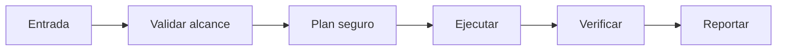

# 🧪 Alchemurgist

<p align="center">
  
</p>

<p align="center">
  <a href="./README.md"></a>
  <a href="./README.es.md"></a>
</p>

## Resumen
Transmutador de formatos legacy: convierte PDF escaneado, Word antiguo y .eml a markdown/JSON estructurado usable por agentes.

## Instalación
```bash
git clone https://github.com/smouj/Alchemurgist.git
cd Alchemurgist
cat SKILL.es.md
```

## Arquitectura de entendimiento


## Estado
Iniciando

## Dificultad
Media
