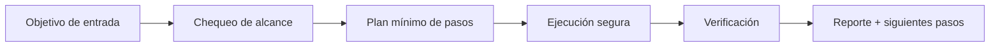

# 🧪 Alchemurgist

<p align="center">
  
</p>

<p align="center">
  <a href="./README.md"></a>
  <a href="./README.es.md"></a>
</p>

<p align="center"><em>🧪 Transmutación de formatos legacy.</em></p>

---

## Resumen
Transmutador de documentos legacy (PDF escaneado, DOC antiguo, texto caótico) a markdown/JSON estructurado usando OCR y parsing robusto.

## Arquitectura de entendimiento


## Instalación
```bash
git clone https://github.com/smouj/Alchemurgist.git
cd Alchemurgist
cat SKILL.es.md
```

## Uso rápido
```bash
printf "ejecutando alchemurgist...\n"
```

## Estado
- Status: Iniciando
- Dificultad: Media

## Roadmap
- [ ] Implementar lógica core v0
- [ ] Añadir tests de integración
- [ ] Publicar tag estable v1.0.0
