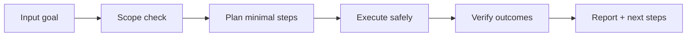

# 🧪 Alchemurgist

<p align="center">
  
</p>

<p align="center">
  <a href="./README.md"></a>
  <a href="./README.es.md"></a>
</p>

<p align="center"><em>🧪 Transmutación de formatos legacy.</em></p>

---

## Overview
Transmutador de documentos legacy (PDF escaneado, DOC antiguo, texto caótico) a markdown/JSON estructurado usando OCR y parsing robusto.

## Architecture of understanding


## Installation
```bash
git clone https://github.com/smouj/Alchemurgist.git
cd Alchemurgist
# read the contract
cat SKILL.md
```

## Quick usage
```bash
# Example placeholder command
printf "running alchemurgist...\n"
```

## Badges
- Status: Initiating
- Difficulty: Media

## Roadmap
- [ ] Implement core logic v0
- [ ] Add integration tests
- [ ] Publish stable tag v1.0.0
